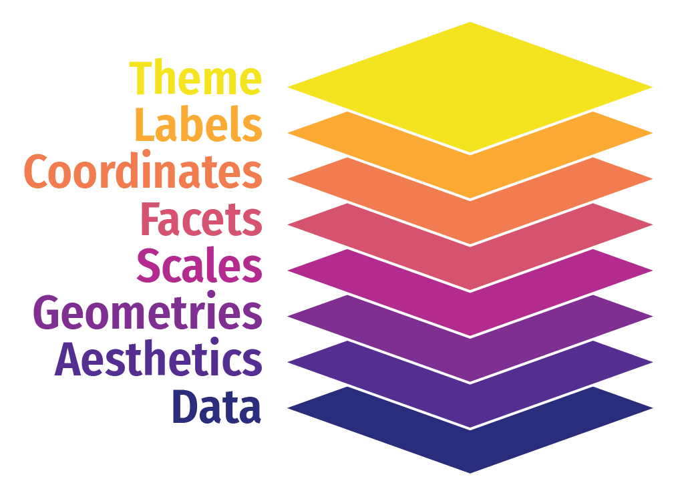

# Intro to ggplot {#sec-ggplot}

```{r, include = FALSE}
library(tidyverse)
library(here)
source("R/booktem_setup.R")
source("R/my_setup.R")
source("R/clean_penguins.R")


```

## Learning Objectives

By the end of this chapter, you will be able to:

- Understand the basic structure of a ggplot and how it builds layer by layer.

- Map data variables to visual aesthetics like position, color, and shape.

- Add and customise plot elements such as labels, themes, and titles.

- Use facets to compare subgroups effectively.

- Apply best practices for clear, meaningful visualisations.


Data visualisation helps us see relationships, patterns, and surprises that tables of numbers can easily hide. In this chapter, we’ll explore how to use **ggplot2**{@R-ggplot2} — part of the tidyverse — to build clear, insightful graphics step by step.

We’ll use our dataset of penguin measurements to explore how different species vary in their culmen dimensions. You’ll learn how to go from a simple scatterplot to well-polished figures that communicate data stories effectively.

:::{.callout-tip}
If you are struggling to write the code for you ggplot, try loading the `esquisse` @R-esquisse add-in to produce a point-and-click interface that will help you build your plot and produce R code at the end. 

:::

```{r, eval = TRUE, echo = FALSE}
downloadthis::download_link(
  link = "https://raw.githubusercontent.com/Philip-Leftwich/Oct-Intro-Analytics/refs/heads/dev/files/penguins_clean.csv",
  button_label = "Clean Penguin Data",
  button_type = "success",
  has_icon = TRUE,
  icon = "fa fa-save",
  self_contained = FALSE
)
```

## Building plots {.unnumbered}

We are using the package `ggplot2` to create data visualisations. It's part of the tidyverse package. Actually, most people call th package `ggplot` but it's official name is `ggplot2`.

We’ll be using the `ggplot2` package to create data visualisations. It’s part of the `tidyverse` suite of packages. Although many people refer to it simply as `ggplot`, its official name is `ggplot2`.

::: grid
::: g-col-6
**ggplot2** uses a layered grammar of graphics, where plots are constructed through a series of layers. You start with a base layer (by calling `ggplot`), then add **data** and **aesthetics**, followed by selecting the appropriate **geometries** for the plot.

These first 3 layers will give you the most simple version of a complete plot. However, you can enhance the plot’s clarity and appearance by adding additional layers such as **scales**, **facets**, **coordinates**, **labels** and **themes**.

:::

::: g-col-6
```{r, eval=TRUE, echo=FALSE, out.width="80%"}

```
:::
:::


```{r}
head(penguins)
```

Let's build a basic scatterplot to show the relationship between `flipper_length` and `body_mass`. We will customise plots further later on in the individual plots. This is just a quick overview of the different layers.

Let’s build a basic scatterplot to show the relationship between `flipper_length` and `body_mass`. We will further customise the plots in subsequent sections, but for now, this will provide a quick overview of the different layers.

* **Layer 1** creates the base plot that we build upon.
* **Layer 2** adds the `data` and some `aesthetics`:
  * The data is passed as the first argument.
  * Aesthetics are added via the mapping argument, where you define your variables (e.g., x or both x and y). This also allows you to specify general properties, like the color for grouping variables, etc.
* **Layer 3** adds geometries, or `geom_?` for short. This tells ggplot how to display the data points. Remember to add these layers with a `+`, rather than using a pipe (`%>%`). You can also add multiple geoms if needed, for example, combining a violin plot with a boxplot.
* **Layer 4** includes `scale_?` functions, which let you customise aesthetics like color. You can do much more with scales, but we'll explore later.
* **Layer 5** introduces facets, such as `facet_wrap()`, allowing you to add an extra dimension to your plot by showing the relationship you are interested in for each level of a categorical variable.
* **Layer 6** involves coordinates, where `coord_cartesian()` controls the limits for the x- and y-axes (xlim and ylim), enabling you to zoom in or out of the plot.
* **Layer 7** helps you modify axis labels.
* **Layer 8** controls the overall style of the plot, including background color, text size, and borders. R provides several predefined themes, such as `theme_classic`, `theme_bw`, `theme_minimal`, and `theme_light`.

Click on the tabs below to see how each layer contributes to refining the plot.

::: {.panel-tabset}
## Layer 1

```{r}
ggplot()
```

There’s not much to see at this stage - this is basically an empty plot layer.

## Layer 2

```{r}
ggplot(data = penguins, mapping = aes(x = body_mass_g, y = flipper_length_mm))
```

You won’t see any data points yet because we haven’t specified how to display them. However, we have mapped the aesthetics, indicating that we want to plot `body_mass` on the x-axis and `flipper_length` on the y-axis. This also sets the axis titles, as well as the axis values and breakpoints.

::: callout-tip
You won't need to add `data =` or `mapping =` if you keep those arguments in exactly that order. Likewise, the first column name you enter within the `aes()` function will always be interpreted as x, and the second as y, so you could omit them if you wish.

You don’t need to include `data =` or `mapping =` if you keep those arguments in the default order. Similarly, the first column name you enter in the `aes()` function will automatically be interpreted as the x variable, and the second as y, so you can omit specifying `x` and `y` if you prefer.

```{r eval = FALSE}
ggplot(penguins, aes(body_mass_g, flipper_length_mm))
```

will give you the same output as the code above.
:::

## Layer 3

```{r}
ggplot(data = penguins, mapping = aes(x = body_mass_g, y = flipper_length_mm, colour = sex)) +
  geom_point()
```

Here we are telling `ggplot` to add a scatterplot. You may notice a warning indicating that some rows were removed due to missing values.

The `colour` argument adds colour to the points based on a grouping variable (in this case, `sex`).  If you want all the points to be black — representing only two dimensions rather than three — simply omit the `colour` argument.

## Layer 4

```{r}
ggplot(data = penguins, mapping = aes(x = body_mass_g, y = flipper_length_mm, colour = sex)) +
  geom_point() +
  # changes colour palette
  scale_colour_brewer(palette = "Dark2") + 
  # add breaks from 2500 to 6500 in increasing steps of 500
  scale_x_continuous(breaks = seq(from = 2500, to = 6500, by = 500)) 
  
```

The `scale_?` functions allow us to modify the color palette of the plot, adjust axis breaks, and more. You could change the axis labels within `scale_x_continuous()` as well or leave it for Layer 7.

## Layer 5

```{r}
ggplot(data = penguins, mapping = aes(x=body_mass_g, y=flipper_length_mm, colour=sex)) +
  geom_point() +
  scale_colour_brewer(palette = "Dark2") + 
  # split main plot up into different subplots by species 
  facet_wrap(~ species) 

```

In this step, we’re using faceting to split the plot by species.

## Layer 6

```{r}
ggplot(data = penguins, mapping = aes(x=body_mass_g, y=flipper_length_mm, colour=sex)) +
  geom_point() +
  scale_colour_brewer(palette = "Dark2") + 
  facet_wrap(~ species) +
  # limits the range of the y axis
  coord_cartesian(ylim = c(0, 250)) 
```

Here we adjust the limits of the y-axis to zoom out of the plot. If you want to zoom in or out of the x-axis, you can add the `xlim` argument to the `coord_cartesian()` function.

## Layer 7

```{r}
ggplot(data = penguins, mapping = aes(x=body_mass_g, y=flipper_length_mm, colour=sex)) +
  geom_point() +
  scale_colour_brewer(palette = "Dark2") + 
  facet_wrap(~ species) +
  labs(x = "Body Mass (in g)", # labels the x axis
       y = "Flipper length (in mm)", # labels the y axis
       colour = "Sex") # labels the grouping variable in the legend
```

You can change the axis labels using the `labs()` function, or you can modify them when adjusting the scales (e.g., within the `scale_x_continuous()` function).

## Layer 8

```{r}
ggplot(data = penguins, mapping = aes(x=body_mass_g, y=flipper_length_mm, colour=sex)) +
  geom_point() +
  scale_colour_brewer(palette = "Dark2") + 
  facet_wrap(~ species) +
  labs(x = "Body Mass (in g)", 
       y = "Flipper length (in mm)",
       colour = "Sex") +
  # add a theme
  theme_classic()

```

The `theme_classic()` function is applied to change the overall appearance of the plot.

:::

::: callout-important

You need to stick to the first three layers to create your base plot. Everything else is optional, meaning you don’t need to use all eight layers. Additionally, layers 4-8 can be added in any order (more or less), whereas layers 1-3 must follow a fixed sequence.

:::


## Common geoms

Given we want a scatter plot, we need to specify that the geometric representation of the data will be in point form, using geom_point(). [There are many geometric object types](https://ggplot2.tidyverse.org/reference/#geoms).

```{r img-objects-enviro, echo=FALSE, fig.cap="geom shapes"}

knitr::include_graphics("images/geoms.png")

```

Here we are adding a layer (hence the + sign) of points to the plot. We can think of this as similar to e.g. Adobe Photoshop which uses layers of images that can be reordered and modified individually. Because we add to plots layer by layer **the order** of your geoms may be important for your final aesthetic design. 

### Scatterplot

```{r}
penguins |>  
  ggplot(aes(x=flipper_length_mm, 
             y = body_mass_g))+
  geom_point() # geom_point function will always draw points, and unless specified otherwise the arguments for position and stat are both "identity".

```

Now we have the scatter plot! Each row (except for two rows of missing data) in the penguins data set now has an x coordinate, a y coordinate, and a designated geometric representation (point).

From this we can see that smaller penguins tend to have smaller flipper lengths.

::: {.panel-tabset}


## Colour for all points

If we want to **change the colour of all the points**, we can add the `colour` argument to the `geom_point()` function.


```{r message=FALSE}

penguins |>  
  ggplot(aes(x=flipper_length_mm, 
             y = body_mass_g))+
  geom_point(colour = "darkorange")
```


## Colour with grouping

If we want the points to **change colour based on another grouping variable**, the `colour` argument should go inside the `aes()`. If you don’t want to define the colours manually, you can use a colour palette like Brewer (`scale_colour_brewer()`) or Viridis (`scale_colour_viridis_d()`).

```{r message=FALSE}
## adding grouping variable Pre_reg_group and changing the colour values manually
ggplot(data = penguins, aes(x=culmen_length_mm, y=culmen_depth_mm, colour = species)) +
  geom_point()+
  scale_colour_manual(values = c("darkorange", "cyan", "purple"))
```

:::


### Add layers

We can see the relationship between body size and flipper length. But what if we want to model this relationship with a trend line? We can add another ‘layer’ to this plot, using a different geometric representation of the data. In this case a trend line, which is in fact a summary of the data rather than a representation of each point.

The `geom_smooth()` function draws a trend line through the data. The default behaviour is to draw a local regression line (curve) through the points, however these can be hard to interpret. We want to add a straight line based on a linear model (‘lm’) of the relationship between x and y. 


```{r}
## Add a second geom ----
penguins |>  
  ggplot(aes(x=flipper_length_mm, 
             y = body_mass_g,
             colour = species))+
  geom_point()+
  geom_smooth(method="lm",    #add another layer of data representation.
              se=FALSE, # no error margins
              ) +
    scale_colour_manual(values = c("darkorange", "cyan", "purple")) 


```

:::{.callout-tip}
Note - that the trend line is blocking out certain points, because it is the ‘top layer’ of the plot. The geom layers that appear early in the command are drawn first, and can be obscured by the geom layers that come after them.

What happens if you switch the order of the geom_point() and geom_smooth()
functions above? What do you notice about the trend line?
:::


### Jitter

`geom_jitter` is used in `ggplot2` to add random noise, or "jitter," to the position of points, preventing them from overlapping in cases where values are identical or closely spaced. 

This technique is especially useful in scatterplots with discrete or categorical data, where it helps reveal the true distribution of points.

Compare these two plots:

```{r, echo = FALSE}

p2 <- ggplot(data = penguins, aes(x = species, 
                                  y = culmen_length_mm)) +
  geom_jitter(width = .2)

p1 <- ggplot(data = penguins, aes(x = species, 
                                  y = culmen_length_mm)) +
  geom_point()

library(patchwork)

p1/p2

```

```{r, eval = FALSE}

## geom point

ggplot(data = penguins, aes(x = species, 
                            y = culmen_length_mm)) +
  geom_point() 

## More geoms ----
ggplot(data = penguins, aes(x = species, 
                            y = culmen_length_mm)) +
  geom_jitter(width = .2) #

```


### Beeswarm

In `geom_beeswarm`, points are arranged to reflect the density of data within each category by "swarming" them horizontally. Higher densities of points cause the swarm to spread out further along the horizontal axis, creating a shape that visually resembles the distribution of the data. This arrangement allows the viewer to understand the concentration and spread of values in each category without overlapping points, making it a clear and informative alternative to box plots or jittered points, especially for datasets with a large number of identical or similar values.

```{r}
library(ggbeeswarm)

## More geoms ----
ggplot(data = penguins, aes(x = species, 
                            y = culmen_length_mm)) +
  geom_beeswarm() # 

```

### Boxplots

Box plots, or ‘box & whisker plots’ are another essential tool for data analysis. Box plots summarize the distribution of a set of values by displaying the minimum and maximum values, the median (i.e. middle-ranked value), and the range of the middle 50% of values (inter-quartile range).
The whisker line extending above and below the IQR box define Q3 + (1.5 x IQR), and Q1 - (1.5 x IQR) respectively. You can watch a short video to learn more about box plots [here](https://www.youtube.com/watch?v=fHLhBnmwUM0).

```{r, eval=TRUE, echo=FALSE, out.width="80%"}
knitr::include_graphics("images/boxplot.png")
```

To create a box plot from our data we use (no prizes here) `geom_boxplot()`

```{r}
ggplot(data = penguins, aes(x = species, 
                            y = culmen_length_mm)) +
  geom_boxplot()

```

```{block, type = "try"}
Note that when specifying colour variables using `aes()` some geometric shapes support an internal colour "fill" and an external colour "colour". Try changing the aes fill for colour in the code above, and note what happens. 

```

The points indicate outlier values [i.e., those greater than Q3 + (1.5 x IQR)].

### Combine geom layers

We can overlay a boxplot on the scatter plot for the entire dataset, to fully communicate both the raw and summary data. Here we reduce the width of the jitter points slightly.

```{r}
ggplot(data = penguins, aes(x = species, 
                            y = culmen_length_mm)) +
  geom_boxplot(outlier.shape=NA)+
  geom_jitter(width=0.2)

```

Q. Why have I now included the argument outlier.shape = NA?

```{r, echo = F}
opts_p <- c(
   "To change the color of the outliers in geom_boxplot",
    "To increase the size of the points displayed by geom_point",
   answer =  "To prevent the box plot from displaying outliers, since geom_point already shows all individual data points."
)
```

`r longmcq(opts_p)`

#### Grouped boxplot

Grouped boxplots are a powerful way to compare distributions across multiple categories within a dataset. In the example below, we use the penguins dataset to visualize the culmen length of different penguin species, further grouped by sex. By setting fill = sex, each species is split into two colored boxplots (one for each sex), making it easy to compare culmen length across both species and sex groups. This approach reveals variations within and between categories, providing a clear visual summary of the data's central tendency and spread for each subgroup.

```{r}
penguins |> 
  drop_na(sex) |> 
ggplot(aes(x = species, 
           y = culmen_length_mm)) +
  geom_boxplot(aes(fill = sex), 
              width = 0.5) # change width of boxplot


```

### Violin plots

Violin plots display the distribution of a dataset and can be created by calling geom_violin(). They are so-called because the shape they make sometimes looks something like a violin. They are essentially sideways, mirrored density plots. Note that the below code is identical to the code used to draw the boxplots above, except for the call to `geom_violin()` rather than `geom_boxplot()`.


```{r}
penguins |> 
  drop_na(sex) |> 
ggplot(aes(x = species, 
           y = culmen_length_mm)) +
  geom_violin(aes(fill = sex),
              width = 0.5)

```

### Line Plots

Line plots are ideal for visualizing trends over time, helping us see how a variable changes across different periods. In this example, we use a line plot to show the number of penguin observations for each species across several years. By mapping species to color, we can track each species individually, making it easy to compare trends across groups. The line plot provides a clear and continuous view of how the number of penguins fluctuates over time, revealing patterns or shifts that might be linked to environmental or population changes.

```{r}

penguin_summary <- penguins |> 
    group_by(species, year) |> 
    summarise(n = n())

penguin_summary |>
    ggplot(aes(x = year, 
               y = n,
               colour = species))+
    geom_line()

```


### Bar plots

Bar plots are useful for visualizing counts or frequencies of categorical data, providing an easy way to compare categories at a glance. In this example, we use a bar plot to display the number of observations for each penguin species in the dataset. By setting species as the x-axis, each bar represents a species, with the height showing the count of observations. This type of plot is effective for summarizing categorical data and identifying which categories are more or less common.

```{r}
penguins |> 
ggplot(aes(x = species)) +
  geom_bar()

```

:::{.callout-tip}
If your dataset already has the counts that you want to plot, you can set stat="identity" inside of geom_bar() to use that number instead of counting rows.
:::

### Histogram plots

A histogram is a type of bar plot used to display the distribution of a continuous variable by grouping data into intervals, or "bins," along the x-axis. Each bin represents a range of values, and the height of the bar shows how many observations fall within that range, providing a visual summary of the frequency distribution of the data.

In `ggplot2`, `geom_histogram()` automatically divides the x-axis into 30 bins and counts the observations in each bin, so the y-axis does not need to be specified. By default, you’ll see a message suggesting you "Pick a better value with binwidth." You can refine your histogram by specifying either the number of bins (e.g., `bins = 20`) or the width of each bin (e.g., `binwidth = 5`) as arguments in `geom_histogram()` to better represent the data’s distribution.

```{r}
penguins |>  
    ggplot(aes(x=culmen_length_mm, 
               fill=species))+
    geom_histogram(bins=50)
```

The layer system makes it easy to create new types of plots by adapting existing recipes. For example, rather than creating a histogram, we can create a smoothed density plot by calling geom_density() rather than geom_histogram(). The rest of the code remains identical.


### Density plots

Unlike histograms, which show raw counts or frequencies, density plots normalize the data so that the total area under each curve sums to 1. This allows density plots to represent the relative distribution of data, regardless of sample size, and makes it easier to compare distributions across groups.

In the example below, each penguin species' culmen length distribution is displayed as a density curve, with each curve’s area summing to 1. This is particularly useful when comparing groups with **different sample sizes**, as the density plot shows the relative shape and spread of each group rather than absolute counts, providing a clearer view of patterns in the data.

```{r}
penguins |> 
    ggplot(aes(x=culmen_length_mm, 
               fill=species))+
    geom_density(alpha = .75)

#Because the density plots are overlapping, we set alpha = 0.75 to make the geoms 75% transparent.

```

:::{.callout-important}

alpha is a very useful argument - it is used to alter the transparency of a geom, it can be used so that overlapping geoms can still be viewed clearly, or as a way to emphasise some geoms over others. 

It isn't generally advisable to use it within aes(), rather set it deliberately and manually.

:::

### Key takeaways

- Choosing the appropriate geom is essential to convey the right message with your data.

- ggplot2’s layering system allows you to add depth to a plot by combining geoms.

- Experimenting with different geoms for the same dataset can reveal new insights and highlight patterns effectively.

Think about the story you want your data to tell and select the geometry that communicates it most clearly.


