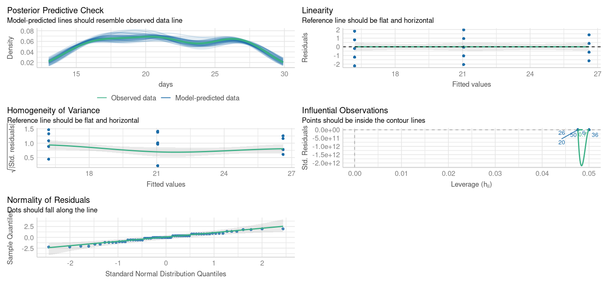

# Model diagnostics {#sec-assumption}


```{r, echo = F, warning = F, message = F}
library(tidyverse)
library(janitor)
library(here)
library(skimr)
library(ggridges)
library(lmtest)
library(patchwork)
library(performance)
library(parameters)
library(sandwich)
library(car)
library(openintro)
source("R/booktem_setup.R")
source("R/my_setup.R")

```


```{r, eval=F, echo=T}

library(tidyverse)
library(here)
library(performance)
library(parameters)
library(sandwich)
library(car)
library(openintro)

```


## Learning Outcomes

By the end of this worksheet, you should be able to:

Explain and visually diagnose the key assumptions of linear regression.

Use R to check residual normality, variance, and linearity.

Identify when assumption violations are due to missing predictors rather than data problems.

Apply corrections (adding predictors, transformations, robust errors) appropriately.

Interpret how model adjustments affect coefficients and inference.

Read and interpret diagnostic plots critically.

## Model assumptions

Linear models are a cornerstone of statistical analysis, widely used across scientific disciplines to explore relationships between variables. Their popularity stems from their simplicity, interpretability, and versatility. However, the reliability of linear models depends on meeting several critical assumptions: 

- Normality of residuals

    - Residuals are "approximately" normally distributed - skewed is particularly bad

- Homogeneity of variance
  
    - Residuals have constant variance (consistent error not changing throughout model)

- Linearity of relationships

    - Predictors have a linear relationship with the outcome (important for continuous predictors)

- Absence of influential outliers 

    - No single or few observations that unduly drive the model 

- Independence 

    - Observations are all equally independent (not in groups, batches or otherwise linked and not accounted for)
    
- Low multicollinearity

    - Predictors are not highly correlated with each other (makes it hard to determine which predictors are important) 

When these assumptions are violated, the model’s conclusions can become misleading, leading to erroneous inferences and predictions. Diagnosing and addressing these violations is a crucial step in any linear modeling workflow. This chapter explores how to evaluate linear models, identify assumption violations, and apply appropriate corrective measures.

## Reading Model Diagnostic Plots

Before any modeling, it’s crucial to know what you’re looking at when using diagnostic tools.

### How to read `check_model()` plots

- Posterior predictive check - density distribution of observed y against predicted y

    - How good is our model at "predicting" data that matches what we observed
    
    - Look at this for unusual patterns in predictions


- Linearity

    - Straight line = good 

- Normal Q–Q Plot – Tests normality of residuals.

    - Points on diagonal = good.

    - S-curve = skewed residuals.

- Homogeneity of Variance – Checks for changing variance.

    - Horizontal line = good.

    - Upward slope = increasing variance.
    
      - Random scatter = good.

    - Curved or funnel shape = assumption violation.

- Influential Observations – Flags outliers/influential points.

    - Points beyond Cook’s distance = potentially problematic.

Take a moment to interpret each plot rather than relying on a single diagnostic.

```{r, eval=TRUE, echo=FALSE, out.width="100%"}

```

## Missing variables

When learning statistics, it’s important to remember that the first step in diagnosing poor model residuals is to ensure that your model includes the correct predictors and interaction terms. Residuals reflect the difference between the observed and predicted values, and large or patterned residuals often indicate that the model is missing key information.

### For example:

If a predictor that strongly affects the outcome is omitted, the model may fail to capture important variation, leading to biased predictions.
If an interaction between two predictors (e.g., temperature and humidity) exists but is not included, the model might not adequately describe the relationship between predictors and the outcome.

### Blood Pressure Data

We’ll use a simple dataset on blood pressure and physiological variables.

```{r, include = FALSE}

bp <- read_csv("files/bp.csv")


```

This dataset includes key physiological and demographic variables — **Blood Pressure, Weight, Age, Albumin (a blood protein level), Pulse, and Stress**. These variables are commonly studied in health and biological research to understand how physiological and psychological factors interact.

```{r, eval = TRUE, echo = FALSE}
downloadthis::download_link(
  link = "https://raw.githubusercontent.com/UEABIO/5027A/refs/heads/2025/files/bp.csv",
  button_label = "Download bp data as csv",
  button_type = "success",
  has_icon = TRUE,
  icon = "fa fa-save",
  self_contained = FALSE
)
```

We are specifically interested in the effects of Weight and Blood albumin levels on blood pressure readings: 

```{r}

bp_model <- lm(BP ~ Weight + Albumin, data =bp)
summary(bp_model)
```

```{r}

performance::check_model(bp_model,
                         detrend = FALSE)

```

**What are the issues with these model residuals?**

```{r, echo = F}
opts_p <- c(
   answer = "non-normality of residuals",
   "Heteroscedasticity of variance",
   answer = "Non-linearity",
   "Outliers"
)
```

`r longmcq(opts_p)`


`r hide("Solution")`

There residuals do not fit the assumption of a normal distribution. In addition there are some non-linear patterns in the residuals that indicate this model may not be the best fit

`r unhide()`


### Improving the blood pressure model

Residual patterns often signal missing information.
If important predictors are omitted, residuals show structure instead of randomness.

Add the missing variable as an additional predictor: 

`r hide("Solution")`

```{r}
bp_model2 <- lm(BP ~ Weight + Albumin + Age, data =bp)

performance::check_model(bp_model2,
                         detrend = F)
```

```{r}

summary(bp_model2)

```

`r unhide()`

### Interpretation Practice

- Compare adjusted R² between the two models — did the fit improve?

- Which predictors changed significance?

- Does adding Age make biological sense for explaining blood pressure?

`r hide("Solution")`

From this we can see that adding Age is an important covariate for our model. If we chose to include Pulse or Stress as well, that would be ok - they don't make the model any worse - but they don't appear to be particularly important. 

From this we can learn that before we attempt any radical data transformations, we should check whether our model would fit the data better with the inclusion of an omitted variable. 

When we do this, not only does our model fit the data better, but our understanding of the importance of our predictor variables changes as well. Previously we would have dismised Albumin levels as unimportant, now we see that when account for Age as a predictor of blood pressure, albumin levels are also a significant predictor. 


`r unhide()`


## Data transformations

When residuals remain non-normal or variance increases with fitted values, transformations can sometimes help.

Transforming the dependent variable (the variable you’re trying to predict) can help fix these issues by changing its scale to better match the assumptions of the model. Here’s how:

- Non-normal residuals: If the dependent variable is heavily skewed (e.g., income or population size), transformations like taking the  log(y) or square root (y) can make the distribution more symmetric.

- Stabilize Variance: If the residuals show increasing or decreasing spread (heteroscedasticity), transformations can help make the variance more constant.

- Linearise Relationships: Some relationships between the dependent and independent variables are non-linear. Transformations can make these relationships more linear, which linear models handle better.

### Example Bacterial Growth

```{r, eval = FALSE, include = FALSE}

# Set random seed for reproducibility
set.seed(123)

# Number of observations
n <- 100

# Generate a continuous predictor: temperature (degrees Celsius)
temperature <- runif(n, min = 20, max = 40)

# Generate a categorical predictor: nutrient type (A, B, C)
nutrient_type <- sample(c("A", "B", "C"), n, replace = TRUE)

# Simulate bacterial growth rate with an exponential relationship to temperature
# and additive effects of nutrient type
growth_rate <- rnorm(n, mean = 0.9, sd = .3) * exp(0.2 * temperature) 
 
  

# Combine into a data frame
data <- data.frame(
  Temperature = temperature,
  Growth_Rate = growth_rate
)

# View the first few rows of the dataset
head(data)

# Optionally save or visualize
# write.csv(data, "bacterial_growth.csv", row.names = FALSE)


```


```{r, include = FALSE}

bacteria_growth_data <- read_csv("files/bacterial_growth.csv")

```


```{r, eval = TRUE, echo = FALSE}
downloadthis::download_link(
  link = "https://raw.githubusercontent.com/UEABIO/5027A/refs/heads/2025/files/bacterial_growth.csv",
  button_label = "Download bacteria data as csv",
  button_type = "success",
  has_icon = TRUE,
  icon = "fa fa-save",
  self_contained = FALSE
)
```

```{r}

# Model and diagnostics
bacteria_model <- lm(Growth_Rate ~ Temperature, data = bacteria_growth_data)

check_model(bacteria_model,
            detrend = FALSE)

```

** What are the issues with this model?**

`r hide("Solution")`

If we look at the residuals we see there are obvious issues with linearity, and heteroscedasticity and normality of the residuals - all of these criteria *might* be improved with the right data transformation

```{r}

check_normality(bacteria_model)

check_heteroscedasticity(bacteria_model)

```

`r unhide()`

#### Boxcox

Box-Cox transformations help identify the best transformation for the dependent variable (y) in a linear model to improve fit, stabilize variance, and address non-normality. The method tests a family of power transformations:

 
How It Works:
The Box-Cox method estimates the optimal value of 𝜆 (the power parameter) that makes the residuals closest to normality and stabilizes variance.

Common transformations include:

- 𝜆= 1: No transformation (original scale).

- λ=0: Log transformation.

- λ=0.5: Square root transformation.


:::{callout-note}

Why Not Use 𝜆 Directly?
The optimal 𝜆is often not a simple value like 0, 0.5, or 1. 
Using a fractional 𝜆(e.g., 0.27) creates a less interpretable transformation.
Instead of applying the exact 𝜆 it’s better to choose a nearby, familiar transformation (e.g., log or square root) for ease of interpretation while still improving the model.

:::

```{r}

car::boxCox(bacteria_model)

```


```{r, eval = TRUE, echo = FALSE, warning = FALSE, message = FALSE}
library(kableExtra)

`lambda value` <- c(0, 0.5, 1, 2 )

`transformation` <- c("log(Y)", "sqrt(Y)", "Y", "Y^1")

box <- tibble(`lambda value`, `transformation`)

box %>% 
   kbl(caption = "Common Box-Cox Transformations", 
    booktabs = T) %>% 
   kable_styling(full_width = FALSE, font_size=16)

```


**What is the optimal transformation for our dependent variable according to the Box-Cox transformation**

```{r, echo =F}
opts_p <- c(
    "Identitity/No transformation",
   "Square root",
   answer = "Logarithm",
   "Inverse"
)
```

`r longmcq(opts_p)`

Apply this transformation to your dependent variable

`r hide("Solution")`


```{r}


# Model and diagnostics
log_bacteria_model <- lm(log(Growth_Rate) ~ Temperature, data = bacteria_growth_data)

check_model(log_bacteria_model,
            detrend = FALSE)

check_normality(log_bacteria_model)

check_heteroscedasticity(log_bacteria_model)

```

`r unhide()`

### Interpretation Practice

- Did the transformation improve residual normality or variance?

- How has the pattern of residuals changed?

- How does interpreting coefficients differ now that the dependent variable is on a log scale?

> Transformations can correct skewness or variance issues, but make interpretation harder since coefficients relate to transformed values.

## Heteroscedasticity

Heteroscedasticity occurs when the residuals (errors) of a linear model have non-constant variance across the range of the predictors. Even if the data appears normal and linear, heteroscedasticity can still be a problem.

Imagine a situation where:

- Residuals are larger (more spread out) for higher values of a predictor, or smaller for lower values.

- Although the relationship between the predictors and the response variable is linear, the variance of the errors changes systematically.

#### Why Does This Matter?

Misleading Inference: Heteroscedasticity doesn’t bias the coefficients of the model, but changing variance (heteroscedasticity) invalidates standard errors, leading to incorrect p-values and confidence intervals.

```{r, include = FALSE}

# Set random seed for reproducibility
set.seed(123)

# Number of observations
n <- 100

# Generate a predictor variable
sunlight<- runif(n, min = 1, max = 10)

water <- runif(n, min=1, max = 20)

# Generate heteroscedastic errors: larger variance for larger values of the predictor
errors <- rnorm(n, mean = 0, sd = sunlight*4)

# Generate the response variable with a linear relationship to the predictor
plant_growth <- 30 + 3 * sunlight + .2*water + errors

# Combine into a data frame
plant_data <- data.frame(
  sunlight = sunlight,
  water = water,
  plant_growth = plant_growth
)

# View the first few rows of the dataset
head(data)

# Optionally save or visualize
# write.csv(plant_data, "files/sunlight_water_data.csv", row.names = FALSE)
```


```{r, include = FALSE}

plant_data <- read_csv("files/sunlight_water_data.csv")

```


```{r, eval = TRUE, echo = FALSE}
downloadthis::download_link(
  link = "https://raw.githubusercontent.com/UEABIO/5027A/refs/heads/2025/files/sunlight_water_data.csv",
  button_label = "Download plant_data as csv",
  button_type = "success",
  has_icon = TRUE,
  icon = "fa fa-save",
  self_contained = FALSE
)
```

```{r}

# Model and diagnostics
plant_model <- lm(plant_growth ~ sunlight + water, data = plant_data)

check_model(plant_model,
            detrend = FALSE)

check_heteroscedasticity(plant_model)
check_normality(plant_model)

```


**What are the issues with these model residuals?**

```{r, echo =F}
opts_p <- c(
   "non-normality of residuals",
   answer = "Heteroscedasticity of variance",
   "Non-linearity",
   "Outliers"
)
```

`r longmcq(opts_p)`


### Robust errors

If coefficients look fine but residual variance is non-constant, we can adjust the standard errors using robust covariance estimators:

In R we can use the package @R-sandwich to help provide robust errors: 

```{r}

coeftest(plant_model, 
         vcov = vcovHC(plant_model, type = "HC1"))

```


### Interpretation Practice

- Compare the standard errors between the default and robust outputs.

- Did any predictors change in significance?

- What does this imply about the reliability of your inference?

:::{callout-warning}

The emmeans package doesn't support the sandwich model outputs directy, but we can supply the same adjustments when running the emmeans function

```{r, eval = FALSE}

# Get robust covariance matrix
robust_vcov <- vcovHC(plant_model, type = "HC1")

# Use emmeans with robust covariance
# specify lists to get predictions for continuous variables
emmeans::emmeans(plant_model, specs = ~ sunlight + water, 
                 at = list(sunlight = c(1:10),
                           water = 1:20),
                 vcov. = robust_vcov)

```

:::


## Non-linearity

In linear models, we assume that the relationship between the predictors (independent variables) and the response (dependent variable) is linear—that is, a change in a predictor is associated with a proportional change in the response. However, real-world data often deviate from this assumption, and relationships can be non-linear. For example, the effect of increasing temperature on plant growth might plateau after an optimal range, or the impact of exercise on health might diminish after a certain intensity.

Let's revisit the janka data from our introductory regression chapter

```{r, eval=T, echo = FALSE}
library(SemiPar)
data(janka)

```

We originally fitted a simple regression model of wood density as a predictor of timber hardness: 

```{r}

janka_ls1 <- lm(hardness ~ dens, data = janka) 

summary(janka_ls1)

```

If we inspect this model we can see there are issues with non-linearity, heteroscedasticity and non-normality: 

```{r}

performance::check_model(janka_ls1)

```


### Transformation

**Which model does a Boxcox transformation suggest is most appropriate?**

`r hide("Solution")`

```{r}

car::boxCox(janka_ls1)

```

`r unhide()`

```{r, echo = F}
opts_p <- c(
   "Identity",
   "square root",
   answer = "log",
   "inverse"
)
```

`r longmcq(opts_p)`

We can fit both a sqrt and log transformed model and compare them: 

```{r}

janka_sqrt <- lm(sqrt(hardness) ~ dens, data = janka)

janka_log <- lm(log(hardness) ~ dens, data = janka)

```


```{r}

performance::check_model(janka_sqrt)

```
This model does not significantly improve the normality or heterogeneity of the residuals, but does improve linearity


```{r}

performance::check_model(janka_log)

```

This model does improve normality and heterogeneity, but introduces an overcorrection on linearity  

### Polynomials

Polynomials are mathematical expressions that allow us to model non-linear relationships between predictors and the response variable in a linear model. By including polynomial terms (e.g., x^2, x^3), we can create more flexible models to capture curvature in the data.

#### What Does `poly(x, 2)` Do?

- `poly(x, 2)` creates a **second-degree polynomial** (quadratic).
- It models the relationship as:
  \[
  y = \beta_0 + \beta_1 x + \beta_2 x^2 + \epsilon
  \]
- This adds curvature to the model, allowing it to capture a U-shape or an inverted U-shape.

##### Example:

If the data looks like a parabola (e.g., plant growth increasing with temperature up to a point, then declining), a second-degree polynomial can model this.


#### What Does `poly(x, 3)` Do?
- `poly(x, 3)` creates a **third-degree polynomial** (cubic).

- It models the relationship as:
  \[
  y = \beta_0 + \beta_1 x + \beta_2 x^2 + \beta_3 x^3 + \epsilon
  \]
  
- This allows for more flexibility in the curve, capturing an S-shaped pattern or two bends in the data.

##### Example:

If the relationship involves multiple changes in direction (e.g., population growth speeding up, then slowing down, and finally stabilizing), a cubic polynomial can model this.

#### Janka data

In our example the slight curvature in the model could be addressed with a quadratic term: 

```{r}

janka_poly<- lm(hardness ~ poly(dens,2), data = janka)


```

But we can see this does not address the issues of heteroscedasticity or non-normality of residuals.

```{r}

performance::check_model(janka_poly)

```

We know that the log transformed dependent variable did address this, but introduced unwarranted curvature - we could address this with a polynomial:

```{r}

janka_polylog<- lm(log(hardness) ~ poly(dens,2), data = janka)


```


```{r}

performance::check_model(janka_polylog)

```

This produces a much better fitting model - but what about interpretation?

```{r}

summary(janka_polylog)

```

We now have an excellent fitting model - but this has come at the cost of interpretation. 

- The coefficients are not directly interpretable

- The relationship with the dependent is on a log scale


#### Polynomial summary

Polynomials can help improve the fit of a model when there is a non-linear relationship. When you do this focus on the overall model fit and visualizations, as the coefficients from `poly()` are not directly tied to raw powers of x. Because of the lack of coefficient interpretation use this with *caution*

- poly(x, 2) (Quadratic): Adds curvature, useful for simple bends like U-shapes.

- poly(x, 3) (Cubic): Adds more flexibility, useful for S-shaped or complex curves.

In our advanced modules we will look at **Generalised Linear Models** which retain the benefits of modelling non-linear relationships with better interpretability


## Multicollinearity

Multicollinearity occurs when predictor variables in a linear model are highly correlated, which can make it hard to isolate the effect of individual predictors. Standard errors inflate and p-values are higher


### Example

The Mammals dataset includes information about various mammal species, focusing on their physical characteristics and ecoogicial traits. 

```{r}
library(openintro)

data("mammals")

```


We will look at the following traits: 

1. **Physiological Variables**:

   - `total_sleep`: The average number of hours a species sleeps per day.
   - `life_span`: The average lifespan of the species in years.
   - `gestation`: The average gestation period (pregnancy duration) in days.
   - `brain_wt`: Brain weight of the species in kilograms.
   - `body_wt`: Body weight of the species in kilograms.

2. **Ecological and Behavioral Variables**:

   - `predation`: A categorical variable indicating the species' risk of predation (e.g., low, medium, high).
   - `exposure`: A categorical variable describing how exposed the species is while sleeping.
   - `danger`: A categorical variable summarizing the overall danger level to the species.


#### Correlations

We can get a good idea of which variables might produce multicollinearity by first seeing which are highly correlated: 

```{r}
mammals |> 
  dplyr::select(total_sleep, life_span, gestation, brain_wt,
               body_wt, predation, exposure, danger) |> 
  GGally::ggpairs()

```

**Which sets of variables have the highest correlations?**

`r hide("Solution")`

- Danger and predation

- Brain weight and Body weight

`r unhide()`

### Fitting a model

I am fitting a model to establish the behavioural and physiological characteristics that predict sleep:

```{r}
mammal_model <- lm(total_sleep ~ life_span + gestation + brain_wt +
               body_wt + predation + exposure + danger, data=mammals)

summary(mammal_model)
```

The model summary suggests that "danger" and "predation" are the most likely predictors of sleep duration

The model residual checks indicate this is an excellent model fit but with high multicollinearity: 

```{r}
performance::check_model(mammal_model)

```

### Correcting for multicollinearity

You may come across methods that describe *correcting for multicollinearity* but in reality there is no need to do so. We **should** report multicollinearity and that we have some uncertainty over which predictors might be *causing* and observed changes. 

## Outliers

Outliers have been left to last because they should be dealt with last. Outliers can be the result of a poor model fit, non-linearity or non-normal residuals. As such they may be resolved when attempting to fix other issues with a model. 

```{r, include = FALSE}

titanosaurs <- read_csv("files/titanosaurs.csv")

```


```{r, eval = TRUE, echo = FALSE}
downloadthis::download_link(
  link = "https://raw.githubusercontent.com/UEABIO/5027A/refs/heads/2025/files/titanosaurs.csv",
  button_label = "Download titanosaur data as csv",
  button_type = "success",
  has_icon = TRUE,
  icon = "fa fa-save",
  self_contained = FALSE
)
```

```{r}

titanosaur_model <- lm(Femur ~ Humerus, data = titanosaurs)

summary(titanosaur_model)
```


```{r}

performance::check_model(titanosaur_model,
                         detrend = FALSE)

```

In this model the residual fits are good (perhaps slight non-linearity, but lets leave that for now). But we have one outlier. 

Assuming all other aspects of the model are good, we can check whether this outlier is affecting our model interpretations by removing it and evaluating the model without it

The diagnostic plot indicates that the data is from **row 1**

The easiest way to address this is to use co-ordinates:

```{r}
# removes row 1 [row, column]
titanosaurs2 <- titanosaurs[-c(1), ]

#refit model
titanosaur_model2 <- lm(Femur ~ Humerus, data = titanosaurs2)

summary(titanosaur_model2)

```

Importantly the model estimate **has**changed, but it is still a significant predictor, and there are no further outliers:

```{r}

performance::check_model(titanosaur_model2,
                         detrend = FALSE)

```

If you remove an outlier causing leverage you must report it, and you should compare the models and report whether it has altered any of your coefficient estimates and significant predictors.


## Summary checklist

| Problem              | How to detect           | Solution                                |
| -------------------- | ----------------------- | --------------------------------------- |
| Non-normal residuals | Q–Q plot                | Transform dependent variable            |
| Heteroscedasticity   | Residual vs fitted plot | Use robust SEs or transform response    |
| Non-linearity        | Residual patterns       | Add predictors or transform Y           |
| Outliers             | Cook’s distance         | Investigate, report, possibly remove    |
| Multicollinearity    | VIF > 5                 | Report |

## Reporting Diagnostics

When reporting results, include:

- Model formula, sample size, and R².

- Diagnostic checks performed and results (normality, variance, outliers).

- Any transformations applied and reasoning.

- Whether outliers or predictors were removed.

- How model fit changed after corrections.
